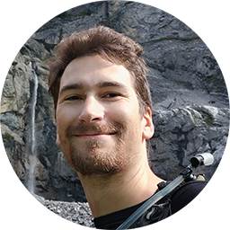

<h1>Thomas Picariello - Staff Software Engineer</h1>
Zurich, CH 
<a href="https://www.linkedin.com/in/thpica/">LinkedIn</a> | <a href="https://github.com/thpica">GitHub</a>

## Profile
Highly versatile Staff Software Engineer with 10 years of experience designing, operating, and scaling distributed multi-cloud systems (GCP/AWS) and core cloud infrastructure powering next-generation AR wearables. Proven track record of cross-functional technical leadership, extending from bare-metal C++ optimizations to global-scale Kubernetes orchestration.

## Technical Skills Inventory
- **Languages:** Go (Golang), C++ (Modern C++11/14/17), Python, TypeScript, JavaScript, SQL
- **Cloud & Infrastructure:** Kubernetes (K8s/GKE/EKS), Terraform (IaC), Istio Service Mesh, Cloud-Agnostic Architecture
- **Data & Security:** PostgreSQL, MongoDB, Elasticsearch, Data Lakes, OAuth2, OpenID Connect (OIDC), Keycloak
- **Architectural Domains:** Distributed Systems, Microservices, Inter-Process Communication (IPC), Split Rendering

---

## Professional Experience

### Magic Leap | Staff Software Engineer
*December 2017 – Present | Zurich, Switzerland*

Architect and scale specialized cloud platform infrastructure, core tools, and device-side software for Augmented Reality (AR) wearable devices across three flagship initiatives.

**ARCloud (On-Premise Digital Twin Platform)**
- **Platform Architecture:** Architected a multi-service, cloud-agnostic Kubernetes platform handling identity, access control, device presence, and collaborative real-time digital twin updates (spatial maps, world meshes).
- **Go Microservices:** Engineered and maintained highly available, shared Go microservices across a multi-cloud (GKE/EKS) stack utilizing Istio service mesh and deep observability tooling.
- **Infrastructure as Code:** Managed end-to-end multi-cloud infrastructure deployments on GKE and EKS via Terraform.
- **Identity & Access Control:** Deployed secure identity infrastructure using Keycloak (OAuth2/OIDC) to enforce strong isolation and zero-trust access control guarantees across distributed platform services.
- **C++ Prototyping:** Spearheaded a collaborative C++ prototype enabling low-latency, real-time on-device visualization of active digital twin synchronization.
- **Technical Leadership:** Mentored junior and senior software engineers on cloud architecture patterns and code quality.

**Android XR (Strategic Partnership with Google)**
- **IPC & Security:** Implemented automated security testing (Flatbuffers fuzzing) on critical Inter-Process Communication (IPC) API surfaces for split rendering systems within the Impress 3D engine.
- **Team Leadership:** Led a small engineering team to integrate custom material support and a new OpenXR extension into the core engine framework.

**Datalab (Large-Scale Perception & Compute Platform)**
- **End-to-End Ownership:** Owned critical platform services end-to-end on GKE, establishing SLOs, directing multi-region capacity planning, and managing automated infrastructure incident response procedures.
- **K8s & Compute:** Built complex Python microservices utilizing custom Kubernetes controllers and Airflow to automate large-scale batch compute workloads and perception data lake evaluation pipelines.
- **C++ Optimization:** Programmed a high-performance C++ codec for low-latency recording and playback of raw sensor and perception data on wearable devices.

---

### Localbini | Startup Chief Technology Officer (CTO)
*September 2015 – October 2017 | St. Gallen, Switzerland*

Directed the end-to-end technical strategy, architecture design, and execution of a global online marketplace platform for guided travel experiences, managing a multi-functional team of 10 professionals.

- **System Architecture:** Designed the complete software platform from scratch, including backend microservices, database schemas, web applications, and mobile deployments (iOS/Android).
- **Operations & Culture:** Successfully launched and scaled the production applications while establishing a highly collaborative, high-performing culture across a multi-cultural engineering department.

---

## Education

**Bachelor of Science (BS) in Information Communication Systems** (2016)
*Specialization:* Electrical Engineering and Embedded Computer Science 
*Tri-National joint degree program completed across three institutions:*
- Fachhochschule Nordwestschweiz (FHNW), Brugg AG (Switzerland)
- Hochschule Furtwangen (HFU), Furtwangen-im-Schwarzwald (Germany)
- Université de Haute-Alsace (UHA), Mulhouse (France)

---

## Languages
- **French:** Native
- **English:** Professional Working Proficiency (C1)
- **German:** Professional Working Proficiency (C1)
